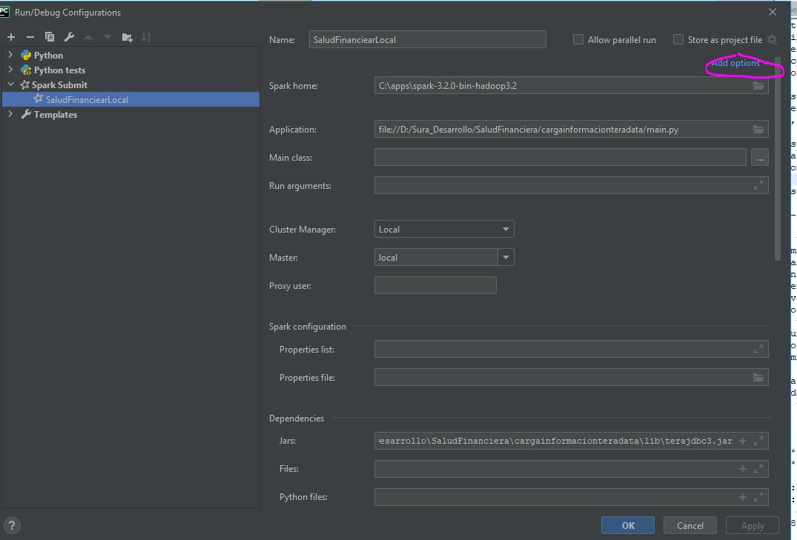

# Carga Informacion Teradata from Salud Financiera LOCAL

Este proyecto es para cargar informacion a teradata

## Installation

Para ejecutarlo descargar https://suramericana-my.sharepoint.com/:u:/g/personal/jhurtadoc_sura_com_co/EdHqIBteI9xLljg5LufTGi4BIu5OOx96Tk3_gdOj03rTSA?e=u8n2Jm
y llevarlo a la carpeta 

1) C:\apps
2) Ir por consolta, recomendable powershell hasta la carpeta raiz delproyecto, por ejemplo:
D:\Sura_Desarrollo\SaludFinanciera\MigrationTeradata>
3) Agregar las siguiente variables de entorno:

HADOOP_HOME=C:\apps\spark-3.2.0-bin-hadoop3.2
Path agregar C:\apps\spark-3.2.0-bin-hadoop3.2\bin
PYSPARK_PYTHON = D:\Usuarios\jeishuca\AppData\Local\Programs\Python\Python38\python.exe
SPARK_HOME = C:\apps\spark-3.2.0-bin-hadoop3.2
SPARK_LOCAL_HOSTNAME = localhost

## Ejecucion bash
```bash
spark-submit --driver-memory 4g --executor-memory 8g --executor-cores 2 --jars .\lib\postgresql-42.0.0.jar,.\lib\terajdbc3.jar IniciarEjecucion.py
```

## Ejecucion Pycharm
1) Buscar la opcion de Spark - Local
Spark-Home C:\apps\spark-3.2.0-bin-hadoop3.2
Application: file://D:/Sura_Desarrollo/SaludFinanciera/cargainformacionteradata/main.py
Dependecies -> Jars : D:\Sura_Desarrollo\SaludFinanciera\cargainformacionteradata\lib\postgresql-42.0.0.jar,D:\Sura_Desarrollo\SaludFinanciera\cargainformacionteradata\lib\terajdbc3.jar 



# Carga Informacion Teradata from Salud Financiera DATABRICKS AZURE

```bash
spark-submit --driver-memory 4g --executor-memory 8g --executor-cores 2 --jars .\lib\postgresql-42.0.0.jar,.\lib\terajdbc3.jar  --conf ""  IniciarEjecucion.py
```